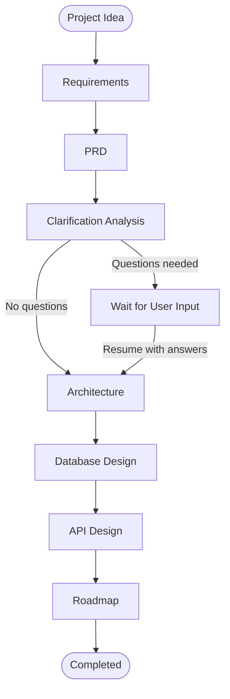
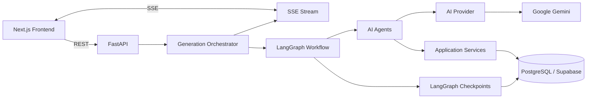
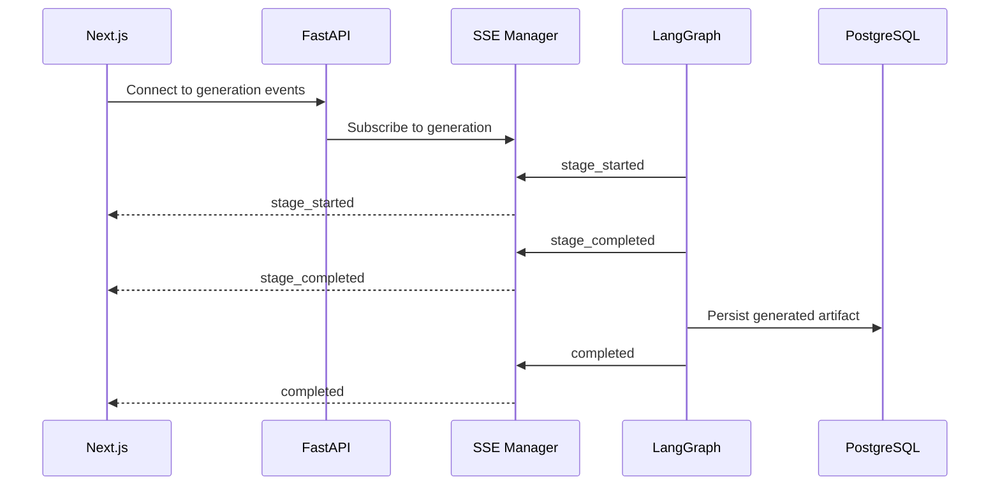

# AI Architect

**AI-powered technical design / architecture generator.**

AI Architect is a personal full-stack project that explores how an AI-assisted workflow can turn a software idea into structured technical design artifacts. You describe a project; a multi-stage workflow generates requirements, a PRD, a system architecture, a database design, an API design, and an implementation roadmap, pausing to ask clarifying questions when the idea is under-specified.

> **Project scope:** This is a personal learning and exploration project. The goal was to build a complete full-stack workflow around AI-assisted technical design, not a production-ready autonomous architecture platform. Generated designs are structured starting points that require engineering review; they are not guaranteed to be correct.

---

## What It Generates

| Stage | Output |
|---|---|
| Requirements | Structured requirements derived from the project idea |
| PRD | Product Requirements Document |
| Clarification | Follow-up questions when more information is needed |
| Architecture | System architecture |
| Database Design | Database design |
| API Design | API design |
| Roadmap | Implementation roadmap |

---

## Core Workflow

The generation pipeline is a [LangGraph](https://langchain-ai.github.io/langgraph/) `StateGraph` with a typed `GenerationState`. Each stage is a graph node: `requirements`, `prd`, `clarification`, `clarification_wait`, `architecture`, `database_design`, `api_design`, `roadmap`.



### Human-in-the-loop clarification

Clarification is optional and only happens when the AI decides more information is needed. The flow is stateful rather than a second independent API call:

1. The clarification agent/service analyzes the requirements and PRD and generates clarification questions.
2. The clarification service persists those questions.
3. The graph reaches the `clarification_wait` node, where LangGraph `interrupt()` pauses execution to wait for user answers, and the generation status becomes `WAITING_FOR_INPUT`.
4. When the user answers, the graph resumes with `Command(resume=answers)` using the same `thread_id`.
5. LangGraph's PostgreSQL checkpointing (`AsyncPostgresSaver`) restores the previous graph state, and generation continues from the architecture stage.

`thread_id = generation_id` ties the checkpointed workflow state to a specific generation.

---

## Architecture



**Layering:** API routes → services → AI agents → AI provider. Workflow orchestration lives in the generation layer.

### Simplified backend structure

```text
app/
├── api/routes/          # REST + SSE endpoints
├── core/                # Configuration and shared utilities
├── db/                  # Database / session management
├── models/              # SQLAlchemy models
├── schemas/             # Pydantic API schemas
├── repositories/
└── services/
    ├── ai/
    │   ├── agents/      # requirements, PRD, clarification, architecture,
    │   │                # database design, API design, roadmap
    │   └── provider     # AIProvider abstraction + Gemini implementation
    ├── generation/      # graph, orchestrator, generation service
    ├── requirements/ prd/ clarification/ architecture/
    ├── database_design/ api_design/ roadmap/
    └── sse/             # SSE manager, stage events
```

---

## AI Layer

### Provider abstraction

AI access goes through an abstract `AIProvider` interface:

```python
generate_structured(prompt, output_schema)
```

`GeminiProvider` is the current (and only) implementation, built on `ChatGoogleGenerativeAI`. The abstraction keeps application services independent of a specific vendor and makes the AI integration replaceable and extensible.

### Structured output

```text
Prompt → Gemini structured output → Pydantic validation → service → database
```

AI responses use structured output and are validated against Pydantic schemas before being passed to the application layer. This keeps artifacts in the expected shape instead of treating model responses as arbitrary text. Schema validation does not guarantee that the generated design is architecturally or semantically correct, so outputs still need human review.

### Retry handling

Gemini requests include bounded retries for transient infrastructure failures:

- Up to 3 attempts, with 1 s then 2 s delays
- Retries transient server/network errors (500, 502, 503, 504, timeouts, service unavailable, gateway timeout)
- Non-retryable errors propagate immediately; quota/rate-limit errors such as 429 are not blindly retried

---

## Generation Lifecycle

Every generation has a persisted status managed by a dedicated `GenerationService`. Clarification is optional, so not every generation passes through `WAITING_FOR_INPUT`:

```text
PENDING → RUNNING ─────────────────→ COMPLETED
              │
              ├→ WAITING_FOR_INPUT → RUNNING → COMPLETED
              │
              └→ FAILED
```

Generation records track the project, workflow, model, status, start/completion time, and error information. The service handles creation, starting, waiting for clarification, completion, failure, and fetching individual or per-project generations.

---

## Real-Time Progress with SSE

AI generation can take long enough that a plain request/response flow gives no useful feedback, so progress is streamed to the UI with Server-Sent Events. SSE fits because the real-time requirement is server → client only; normal client → server operations still use REST.



**Endpoint:** `GET /projects/{project_id}/generations/{generation_id}/events`

**Events:** `status`, `stage_started`, `stage_completed`, `stage_waiting`, `stage_failed`, `clarification_required`, `completed`, `failed`

**Implementation notes**

- `SSEManager` keeps a set of subscriber `asyncio.Queue`s per `generation_id`; `publish()` fans an event out to every subscriber, so multiple connections can observe the same generation.
- The endpoint uses `StreamingResponse` with `text/event-stream`, detects client disconnects, and sends a 15-second keep-alive.
- When a client connects, the endpoint checks the current generation state. For generations that are `WAITING_FOR_INPUT`, `COMPLETED`, or `FAILED`, it can immediately send the relevant current state instead of waiting for an event that may never come. For an active generation, subsequent lifecycle events are streamed through the per-generation `asyncio` queue.
- Stage execution publishes through a `safe_publish()` wrapper. SSE notifications are treated as non-critical, so a notification failure does not fail the generation stage. Actual generation exceptions still propagate and mark the generation as `FAILED`.

**Durable state vs. live events:** PostgreSQL is the durable source of truth for generation state and artifacts. SSE is only a transient live notification mechanism, so losing a connection never means losing a generation.

---

## Engineering Decisions

- **Separation of concerns:** routes, services, agents, and provider are distinct layers; orchestration is isolated in the generation layer.
- **Provider abstraction:** Gemini-specific code is confined behind `AIProvider`.
- **Structured outputs:** AI responses are validated against Pydantic schemas (shape, not semantic correctness).
- **Stateful workflow:** LangGraph checkpointing lets the workflow pause and resume around user clarification.
- **Explicit lifecycle:** generation status is persisted and updated through a dedicated service rather than inferred from frontend state.
- **Failure handling:** transient Gemini failures get bounded retries; SSE delivery failures don't terminate generation.

## Challenges & Solutions

| Challenge | Solution |
|---|---|
| Multi-stage AI workflow where later stages depend on earlier outputs | LangGraph `StateGraph` with one node per stage and shared typed state |
| AI may need more information before generating architecture | Persist the questions, pause with `interrupt()`, and resume with `Command(resume=answers)` using PostgreSQL checkpointing |
| Long-running generation with no progress feedback | SSE with per-generation `asyncio.Queue`s streaming stage lifecycle events |
| Losing an SSE connection shouldn't lose the generation | Durable state in PostgreSQL; SSE treated as transient notification only |
| Temporary AI API failures | Bounded retries for selected transient errors in `GeminiProvider` |

---

## Tech Stack

**Backend:** Python, FastAPI, Pydantic, SQLAlchemy, Alembic, PostgreSQL / Supabase, LangChain, LangGraph, Google Gemini, SSE, pytest, uv

**Frontend:** Next.js, TypeScript, Tailwind CSS, shadcn/ui, TanStack Query

---

## Getting Started

### Prerequisites

- Python
- [uv](https://docs.astral.sh/uv/)
- A PostgreSQL database (local or Supabase)
- A Google Gemini API key

### Install dependencies

The project includes a `uv.lock` file, so dependencies can be installed with `uv`:

```bash
uv sync
```

### Configure the environment

The backend is configured through environment variables. The AI provider requires:

```env
GEMINI_API_KEY=
GEMINI_MODEL=
DATABASE_URL=postgresql+psycopg://<user>:<password>@<host>:<port>/<database>
```

`DATABASE_URL` is the connection string for your PostgreSQL / Supabase database.

### Set up the database

Database schema changes are managed with Alembic. Apply the migrations to your PostgreSQL database before starting the backend for the first time.

### Run the backend

```bash
uv run python run.py
```

`run.py` starts the FastAPI application (`app.main:app`) with Uvicorn on port 8000.

### Run the tests

```bash
uv run pytest
```

---

## Limitations

- Generated designs can be incomplete or wrong and should be reviewed by an engineer.
- Gemini is the only AI provider currently implemented; the abstraction only makes adding others straightforward.
- SSE uses in-process `asyncio` queues, so it targets a single backend instance (no distributed event streaming).
